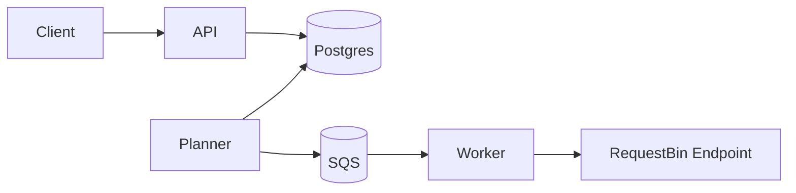
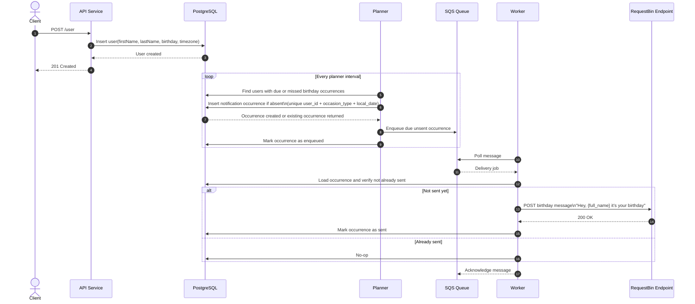
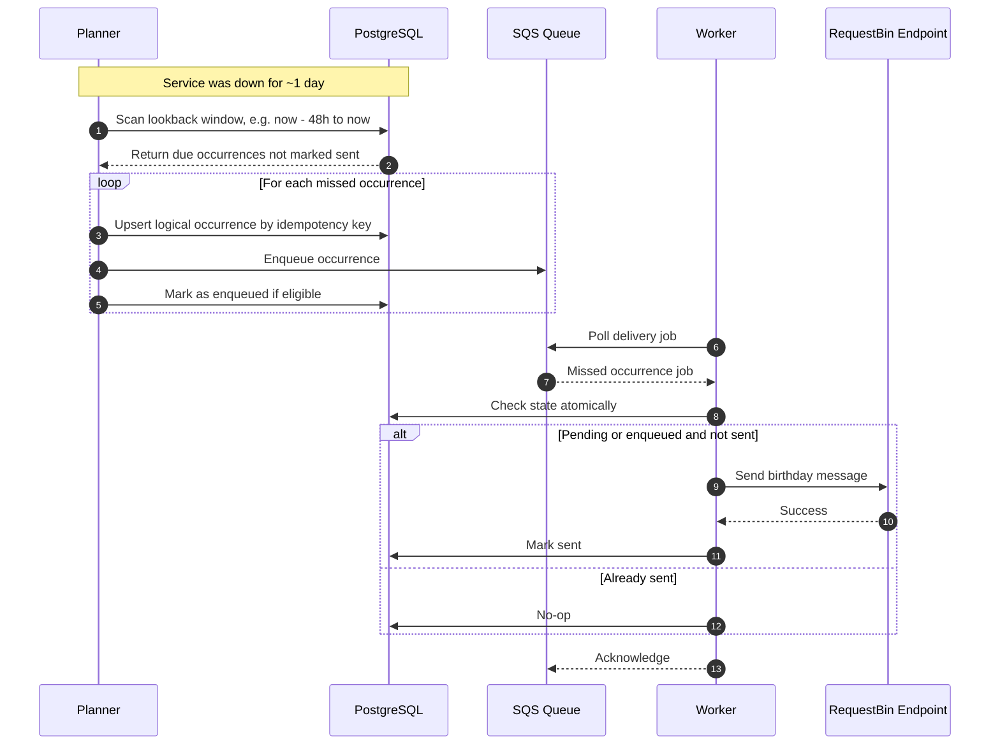

# Architecture

## Overview
The service is designed as a small event-driven system:
- API manages users
- planner determines what is due
- SQS buffers delivery jobs
- worker performs outbound sends
- PostgreSQL stores durable state

This architecture is intentionally simple but scalable.

## High-level flow
```text
Client
  -> API
  -> PostgreSQL

Planner
  -> PostgreSQL
  -> SQS

Worker
  -> SQS
  -> PostgreSQL
  -> RequestBin-like endpoint
```

## Core design decisions

### 1. Canonical timezone storage
Store a canonical IANA timezone string on the user record.

Why:
- deterministic
- easy to validate
- easy to test
- avoids ambiguous free-form locations

### 2. Durable occurrence record
Each logical birthday send should have a durable record.

Why:
- enables recovery after downtime
- prevents duplicates
- creates an audit trail
- supports retry safety

### 3. Planner plus worker split
Separate due detection from outbound delivery.

Why:
- planner remains lightweight
- worker can scale independently
- queue smooths bursts
- outbound failures do not block scheduling

### 4. SQS over SNS
Use SQS for the first version.

Why:
- current flow needs durable work queue semantics more than fan-out
- simpler locally with LocalStack
- enough for one delivery consumer

SNS may be added later if multiple downstream subscribers need the same event.

### 5. PostgreSQL for source of truth
PostgreSQL stores users and delivery state.

Why:
- strong consistency primitives
- unique constraints for idempotency
- good indexing and transactional behavior
- easy local setup

## Domain model

### User
Represents a person eligible for scheduled notifications.

Fields:
- `id`
- `first_name`
- `last_name`
- `birthday`
- `timezone`
- `created_at`
- `deleted_at` optional

### NotificationOccurrence
Represents one logical send for one occasion.

Fields:
- `id`
- `user_id`
- `occasion_type`
- `local_occurrence_date`
- `due_at_utc`
- `status`
- `idempotency_key`
- `enqueued_at`
- `sent_at`
- `last_error`

### DeliveryAttempt
Represents an attempt to send a notification.

Fields:
- `id`
- `occurrence_id`
- `attempt_number`
- `result`
- `error`
- `timestamps`

## Scheduling model
The business rule is:
- send on the user's birthday
- at exactly 9:00 AM local time

Recommended implementation strategy:
- planner periodically computes whether a user has a due birthday occurrence within the lookback window
- planner inserts the occurrence if absent using a unique logical key
- planner enqueues the occurrence if not already sent

This avoids maintaining millions of future scheduled rows unnecessarily.

## Idempotency strategy
Logical send uniqueness is enforced by a DB-level unique constraint.

Recommended logical key:
```text
(user_id, occasion_type, local_occurrence_date)
```

Result:
- repeated planner runs are safe
- concurrent planner instances are safe
- repeated worker deliveries can check state and become safe

## State transitions
Suggested occurrence state machine:

```text
pending -> enqueued -> sent
pending -> failed
enqueued -> failed
failed -> enqueued
```

Alternative simplification:
- `pending`
- `sent`
- `failed`

with queue state tracked separately. Either is acceptable if the transitions are atomic and testable.

## Concurrency and race conditions
Duplicate sends are unacceptable, so concurrency safety is essential.

Recommended protections:
- unique DB constraint on logical send key
- transactional state updates
- conditional updates such as `WHERE status != 'sent'`
- queue consumer safe against redelivery
- optional `FOR UPDATE SKIP LOCKED` when claiming batches

## Downtime recovery
Planner should scan a configurable lookback window.

Example:
- every minute, planner checks occurrences due between `now - 48h` and `now`
- anything not marked sent is eligible for enqueueing

This allows recovery if the service was down for roughly a day.

## Scalability considerations
For thousands of birthdays per day:
- index `due_at_utc`
- index `status`
- batch planner queries
- page through due work
- scale workers horizontally
- use DLQ for repeated failures

Potential later improvements:
- sharded planner ranges
- outbox pattern for enqueue durability
- EventBridge integration
- metrics and tracing

## Recommended modules

### Domain
Contains business rules only.
- user entity
- occasion rules
- scheduler logic
- message formatting
- idempotency key generation

### Infrastructure
Contains external integrations.
- PostgreSQL repositories
- SQS adapter
- outbound HTTP client
- configuration loader
- logger

### App
Contains runtime entry points.
- HTTP server
- planner loop
- worker loop

## LocalStack notes
Use LocalStack to emulate SQS locally.

Typical setup:
- LocalStack on `http://localhost:4566`
- AWS SDK configured with endpoint override
- dummy credentials for local use

Example AWS SDK config pattern:
```ts
{
  region: process.env.AWS_REGION,
  endpoint: process.env.AWS_ENDPOINT_URL,
  credentials: {
    accessKeyId: 'test',
    secretAccessKey: 'test'
  }
}
```

## Tradeoffs

### Why not cron per user
- does not scale well
- operationally messy
- difficult to recover after downtime
- harder to reason about duplicate prevention

### Why not in-memory scheduler only
- loses work on restart
- weak recovery story
- poor horizontal scaling characteristics

### Why not SNS first
- current need is durable job processing, not multi-subscriber broadcast
- SQS is simpler and more directly aligned to the requirement

## Recommended implementation sequence
1. scaffold TypeScript project
2. implement user API
3. add DB schema and repositories
4. implement timezone-safe due calculation
5. implement occurrence persistence with unique constraint
6. implement planner enqueue flow
7. implement worker outbound send flow
8. implement recovery logic
9. add concurrency hardening and retries
10. document operations and tests

## What success looks like
- local environment boots cleanly
- user can be created and deleted
- due birthday jobs are enqueued correctly
- outbound message is sent exactly once
- missed jobs are recovered after downtime
- new occasion types can be added without redesigning the whole system

## Diagram



## Sequence Diagrams


### Downtime 

