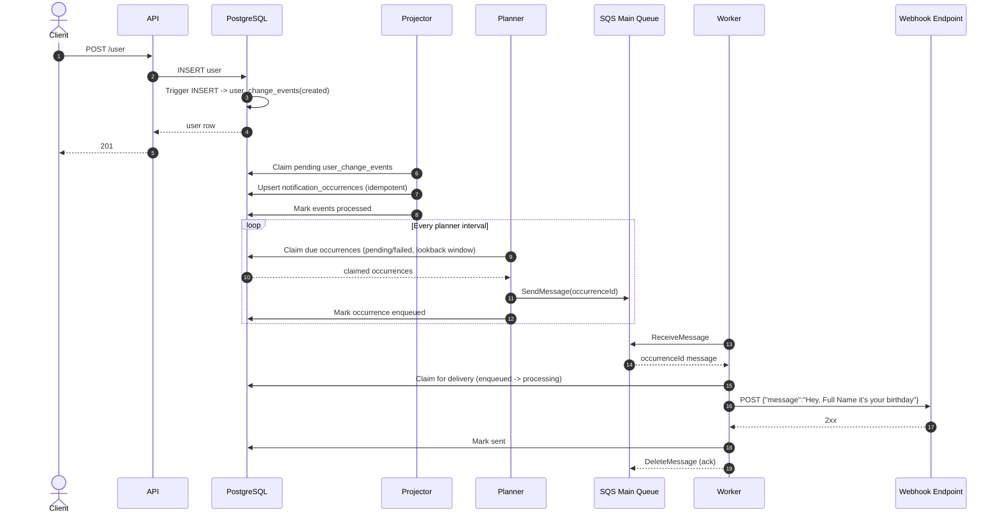
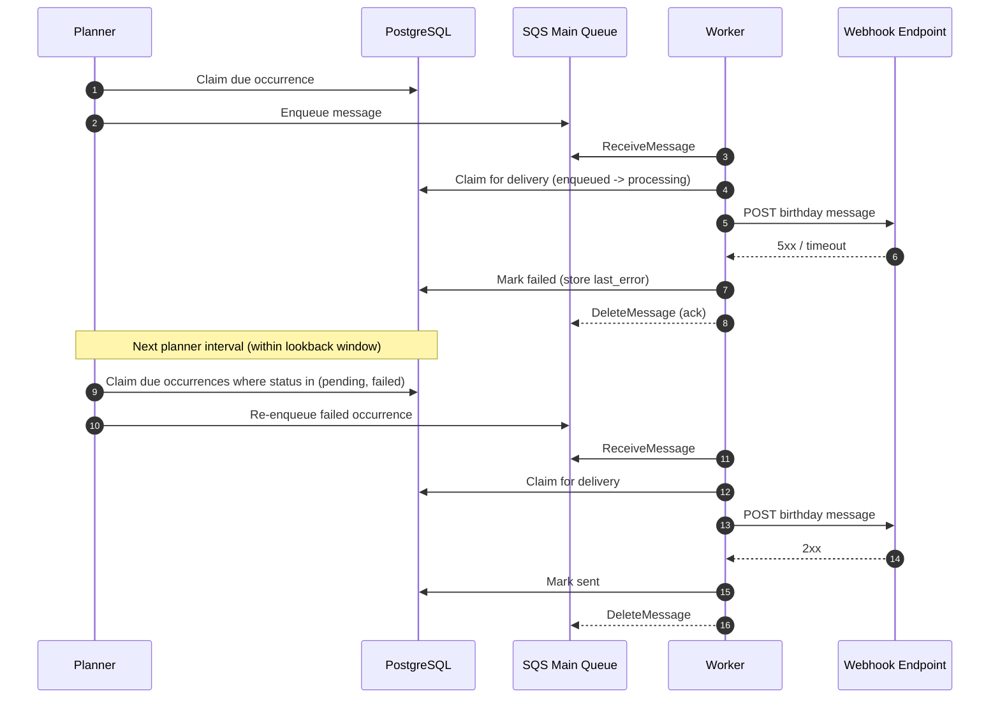
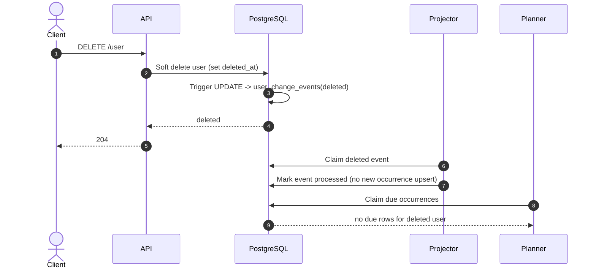
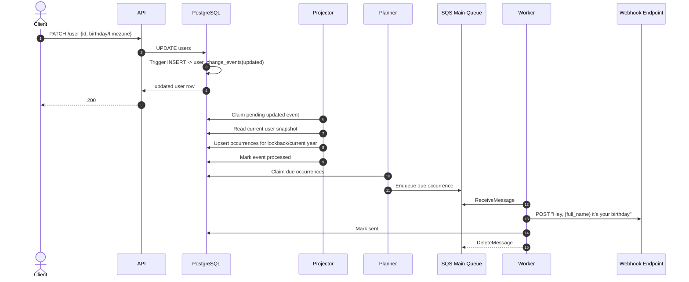

# Architecture

## Overview
The service is a planner + worker system with PostgreSQL as source of truth:
- API manages users (`POST /user`, `PATCH /user`, `DELETE /user`)
- Projector processes DB user-change events and upserts occurrences
- Planner only claims due occurrences and enqueues them
- SQS buffers delivery jobs
- Worker consumes SQS and performs outbound HTTP delivery
- PostgreSQL stores durable user and occurrence state

Current local infrastructure includes SQS main queue + DLQ provisioning (via Terraform + LocalStack).

## High-Level Components
```text
Client -> API -> PostgreSQL

Projector -> PostgreSQL
Planner -> PostgreSQL -> SQS (main queue)
Worker -> SQS (main queue) -> PostgreSQL -> Outbound HTTP endpoint

SQS main queue -> DLQ (redrive policy provisioned)
```

## Data Model

### `users`
- `id`
- `first_name`
- `last_name`
- `birthday` (`YYYY-MM-DD`)
- `timezone` (canonical IANA)
- `created_at`
- `deleted_at` (soft delete marker)

### `notification_occurrences`
- `id`
- `user_id`
- `occasion_type` (`birthday`)
- `local_occurrence_date`
- `due_at_utc`
- `status` (`pending`, `enqueued`, `processing`, `sent`, `failed`)
- `idempotency_key`
- `enqueued_at`
- `sent_at`
- `last_error`
- `created_at`
- `updated_at`

Logical uniqueness is enforced at DB level by:
`(user_id, occasion_type, local_occurrence_date)`.

### `user_change_events`
- `id`
- `user_id`
- `event_type` (`created`, `updated`, `deleted`)
- `created_at`
- `claimed_at`
- `processed_at`
- `error`

## Scheduling and Delivery Behavior

### Birthday scheduling rule
- Send at exactly `09:00` in the user's local timezone.
- Projector computes `due_at_utc` from birthday + timezone.
- Projector uses configurable lookback window to determine candidate years (`lookback year`, `current year`).

### Projector behavior
- DB trigger on `users` writes `user_change_events` on create/update/delete.
- Projector claims pending events (`FOR UPDATE SKIP LOCKED`).
- For each active user event:
  - computes candidate years from lookback window and now
  - upserts idempotent occurrences when due time falls in lookback window.
- For deleted/missing users: marks event processed without creating occurrences.
- On processing failure: stores event error and releases claim for retry.

### Planner behavior
- Claims due occurrences with `FOR UPDATE SKIP LOCKED`.
- Enqueues claimed occurrences to SQS.
- On enqueue failure, marks occurrence `failed`.

### Worker behavior
- Polls SQS messages.
- Claims occurrence atomically only if `status='enqueued'` and not sent.
- Sends outbound message: `Hey, {full_name} it’s your birthday`.
- On outbound success: marks `sent`.
- On outbound failure: marks `failed`.
- Always acknowledges the SQS message after processing attempt.

## Idempotency and Concurrency
- Occurrence upsert + unique logical key prevents duplicate logical sends.
- Worker claim transition (`enqueued -> processing`) prevents concurrent duplicate processing.
- Sent transition is conditional (`status='processing' AND sent_at IS NULL`).
- Repeated planner runs are safe because creates are idempotent and claim query is state-filtered.

## Retry and Recovery Model (Current)
- Retries currently happen via planner lookback re-claiming `failed` occurrences.
- Worker acknowledges messages even on failure, so queue redelivery is not used for retries.
- DLQ and redrive policy are provisioned in queue topology for operational hardening and future retry semantics.

## Sequence Diagrams

### 1) Happy Path: User -> Due Occurrence -> Sent


### 2) Outbound Failure + Lookback Recovery Retry


### 3) Deleted User Safety


### 4) Edit Birthday/Timezone


## Local Infrastructure Notes
- Queue topology is provisioned with Terraform (`infrastructure/terraform/localstack-sqs`):
  - main queue: `birthday-delivery-queue`
  - DLQ: `birthday-delivery-dlq`
  - redrive policy (`maxReceiveCount`)
  - visibility timeout and retention configuration

## Scalability Notes
- Projector uses batched event claims + due-time upserts.
- Planner uses due-claim batch size only (enqueue-only responsibility).
- Queue decouples scheduling from outbound delivery throughput.
- Worker can scale horizontally with DB claim guards.
- Indexed due/status queries keep planner scans bounded.
